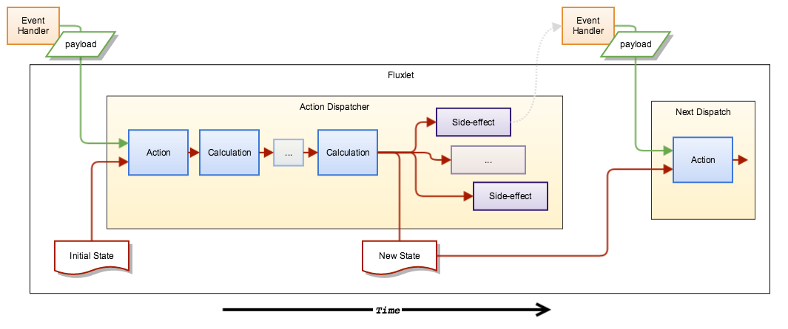

# Fluxlet

Fluxlet is a micro-framework for managing state within your application.

Its focus is on the predictable uni-directional flow of immutable data within
a single round of the event loop.

## Overview

Data comes in from an event, an **action** is dispatched which updates the
state, which can then flow through a series of **calculations** which perform
further updates of the state, and finally into a bunch of **side-effects**
which do stuff with the resulting state.

This diagram illustrates the flow of data through a Fluxlet...

The lines represent the actual flow of data, green is data from the event,
and red is the state. The shaded rectangles are functions.

## Why?

The whole point of this is that from any action dispatch (knowing the payload
and starting state), you should be able to reason about (and reliably test)
the end state, and know exactly what side-effects should be performed. You
should be able to reason about the exact state of your application and what
async tasks it's performing at any time.

## The Component Functions

An **action** is a pure function that takes a payload and a state and returns
a new state.

_I lied a little, an action function actually takes the payload and returns
another function that takes the state, the reasons for this become clear when
you create actions using immutable state update functions._

The new state from the action is passed into a chain of **calculations**,
which are also pure functions that take state and return new state.

The state from the last calculation is then passed into all of the
**side-effects**, which are functions that take the state and do stuff,
eg. render to DOM, make requests, but they can't directly affect the state.

For the sake of clarity, there is some detail missing from the diagram above:
The initial state is also passed to every calculation and side-effect so that
they can compare the current state to the previous state to determine if they
actually need to do anything. This previous state should be used simply for
comparison purposes.

An overview of the component function signatures:

- **action**: (...payload) -> (initial-state) -> transient-state
- **calculation**: (transient-state, initial-state) -> transient-state
- **side effect**: (final-state, initial-state, dispatchers) -> void

_The state from the final calculation in the chain (or the action if no
calculations are called) becomes the final state_

You explicitly register these component functions with a Fluxlet using its
fluent API at construction time.

## Dispatchers

Fluxlet creates a separate **dispatcher** function for every action, but they
all call a shared set of calculations and side-effects.

It's these dispatcher functions that are called from async event handlers, or
other fluxlets.

## One Big Immutable State

State within a Fluxlet is a single immutable JS object, the state must NEVER
be modified by a component function. **Actions** and **calculations** must
either return the same unmodified state or a new version of the state.

_TODO: Could do with a reference to how immutable data structures work here_

## The Rules

**Action** and **calculation** functions must be _pure referentially
transparent_ functions, that is, they can use data given to them and should
return a consistent state from the data passed in - they MUST NEVER use data
from elsewhere or perform any side-effects.

**Side-effects** on the other hand, as the name suggests can perform
side-effects, but they can not alter state or directly dispatch another action.
They can however call an action dispatcher from within an async event
handler, eg. timeout, ajax callback.

A **side-effect** should do as little as possible, delegating any data
processing to a **calculation** wherever possible. It should also source any
transient data from the state and not directly from the DOM, ie. form values
should be fed into the state via an action. Keeping the state as the
authoritative state of the application at any time. Although it may check the
DOM to determine whether it needs to update it or not.

## Example

    import fluxlet from "fluxlet"
    import { update } from "fluxlet-immutable/update"

    export default function() {
      fluxlet('hello-world')
        .state({
          name: '',
          response: ''
        })
        .actions({ setName })
        .calculations({ formulateResponse })
        .sideEffects({ deliverResponse })
        .init(bindGlobalEvents)
    }

    function bindGlobalEvents(dispatch) {
      document.getElementById("id")
        .addEventListener("input", (event) => dispatch.setName(event.target.value))
    }

    // Actions
    const setName = (name) => update('name', name)

    // Calculations
    const formulateResponse = update('response', (x, state) => `Hello ${state.name}`)

    // Side-Effects
    const deliverResponse = (state) => {
      document.getElementById("out").textContent = state.response
    }

This example uses the *update* function from the
[fluxlet-immutable](/fluxlet/fluxlet-immutable) library, which is in a separate
package as you may want to use whatever immutable library you prefer.

For a richer example see the
[fluxlet-example-todomvc](/fluxlet/fluxlet-example-todomvc).

Oh and btw, all of the Fluxlet code, additional libraries and examples are
written and take advantage of ECMAScript 2015 syntax, but only use API features
from ES5.

## Documentation

Read the [fluxlet source](src/fluxlet.js) source, and/or the _groc_ generated
docs.

Docs can be generated using groc:

    $ groc

And then opened directly from the filesystem in a browser.

## Development

    $ npm install

## Tests

Test are run using karma and jspm:

    $ npm test

or

    $ jspm install
    $ karma start

There is also a config for Wallaby if you have it installed in your IDE.
